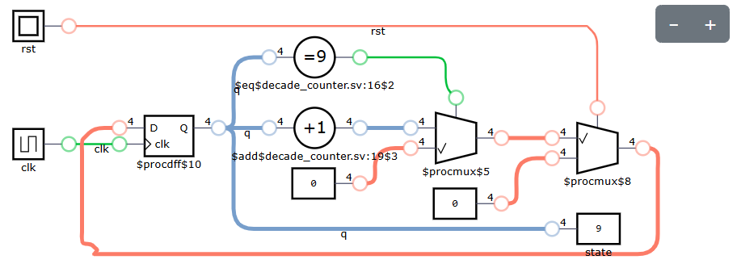
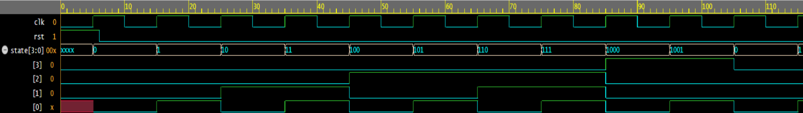

# Decade Counter

As part of the IC Design Training program, I implemented a mod-10 counter. A mod-10 counter, or a decade counter, is a common counter circuit that counts values from 0-9. 

I originally implemented the circuit in Verilog, but I have added the SystemVerilog implementation as well. Both implementations differ only slightly in syntax but will produce the same output and waveform.

  
  <i>Synthesized from Yosys</i>

## Waveform
The following is the waveform of the implemented decade counter. The simulation will remain the same for both Verilog and SystemVerilog. 

  

## How to Run the Code
To run the same code, you need a software like ModelSim, Quartus Prime, or Vivado. However, for a quick simulation without installation, you can use EDA Playground to simulate the code using the following instructions:
1) Go to EDA Playground website and create an account
2) Paste your module and testbench code
3) Select Icarus Verilog in "Tools & Simulators"
4) Check the "Open EPWave after run" tickbox
5) See the waveform

## How to Synthesize the Circuits
If you don't have software like QuartusPrime or Vivado for synthesis, you can use the open-source version Yosys. To synthesize your Verilog/SystemVerilog code quickly and view its circuit diagram without any installation:
1) Go to https://digitaljs.tilk.eu/.
2) Upload your file
3) Press Run